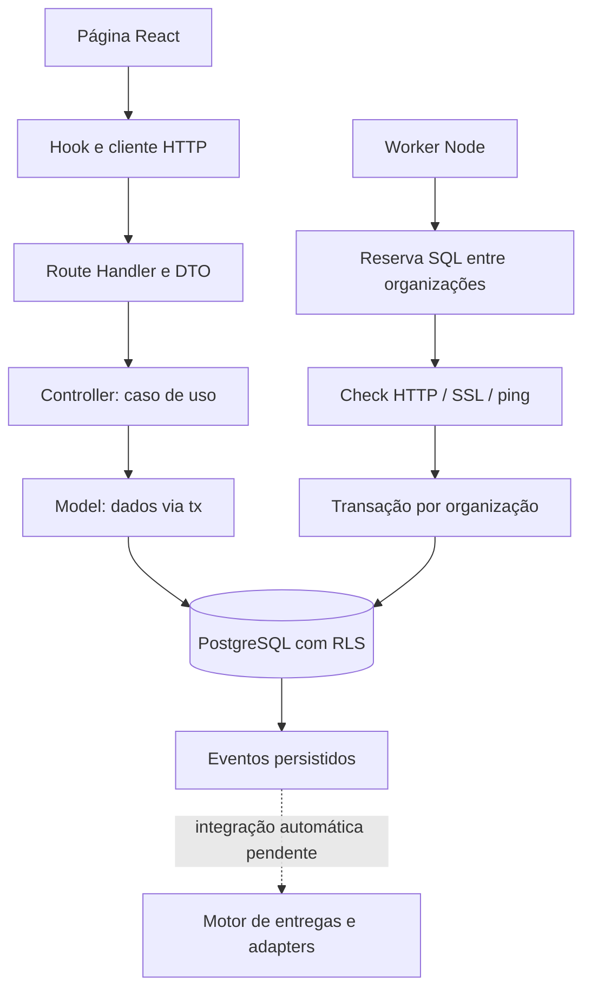

# Arquitetura e conceitos

[Índice](README.md)

O hawkdot monitora infraestrutura de várias organizações no mesmo PostgreSQL. O isolamento é feito por RLS (Row-Level Security: regras no banco que determinam quais linhas um papel pode ler ou alterar).

## Vocabulário

| Conceito | Significado e exemplo |
|---|---|
| Usuário | Pessoa com email e senha; pode participar de várias organizações |
| Organização / tenant | Espaço isolado de dados de uma equipe |
| Membership | Vínculo usuário–organização com papel e status; convite ainda não é vínculo ativo |
| Recurso | Alvo cadastrado: domínio, IP ou endpoint HTTP |
| Monitor | Configuração de uma checagem periódica sobre um recurso |
| Execução | Resultado de uma tentativa, com horários, status e latência |
| Incidente | Período de falha confirmado pelos thresholds do monitor |
| Evento | Registro de uma transição ou aviso, consumível por notificações |
| Canal | Destino Telegram ou webhook |
| Regra | Seleção de eventos, severidade, canais e cooldown |
| Entrega | Tentativa lógica de enviar um evento para um canal pela regra |
| Credencial | Segredo cifrado; API expõe apenas metadados |
| Auditoria | Registro de ação sensível, ator e alterações permitidas |

`status` de monitor (`active/paused/archived`) controla operação. `current_state` (`unknown/up/down/degraded`) descreve saúde. `check_status` descreve uma execução (`success/failure/timeout/error`). Pausar não significa que o alvo caiu.

## Fluxo completo

Uma requisição protegida verifica o cookie, abre `withTenant`, define contexto transacional e passa `tx` ao controller/model. Todo trabalho daquela transação confirma junto ou é desfeito junto. O worker usa outro login e define apenas organização, sem agir em nome de usuário.

## Mapa de pastas

| Pasta | Responsabilidade |
|---|---|
| `src/app/(auth)` | Login e signup |
| `src/app/(dashboard)` | Shell, visão geral, recursos e monitores |
| `src/app/api` | Fronteira HTTP da API |
| `src/components` | UI reutilizável ou específica de recurso |
| `src/hooks` | Sessão, carregamento, polling e estado remoto |
| `src/lib/api` | Cliente HTTP e tipos usados pelo navegador |
| `src/controllers` | Casos de uso e autorização |
| `src/models` | Operações de dados da API |
| `src/lib/dto` | Schemas Zod, tipos de entrada e parsing |
| `src/lib/errors` | Erros de aplicação, Prisma e resposta HTTP |
| `src/lib/auth`, `tenant`, `crypto`, `audit` | Funções transversais de segurança e contexto |
| `src/config` | Ambiente validado e conexão singleton da API |
| `src/worker` | Scheduler, checks, estado, eventos e conexão do worker |
| `src/notifications` | Motor de regras, despacho e adapters |
| `src/test-utils` | Factories, clients de teste e limpeza |
| `db` | SQL fonte de verdade: estrutura, grants, RLS e funções |
| `prisma` | Representação usada para gerar tipos/client |
| `e2e`, `scripts`, `docker` | Testes de navegador, utilitários e banco local |

Imports internos novos usam `@/` (equivale a `src/`). Arquivos backend usam recurso singular e kebab-case: `notification-channel.controller.ts`. Pastas HTTP usam plural: `/api/notification-channels`.

## Escopo real

A UI cobre autenticação, recursos, monitores e visão geral. Equipe e notificações aparecem desabilitadas no menu. Há endpoints de membros, credenciais, regras, canais e auditoria, mas ainda não há telas completas para eles. O banco prevê DNS, TCP, database e server agents; os checks executáveis atuais são SSL, HTTP e ping. Não há API de histórico completo nem uptime histórico calculado.

A direção obrigatória de dependências é rota → controller → model → client. Existem chamadas diretas de `tx` em helpers/controllers legados, como `require-role.ts` e `session.controller.ts`; isso não é modelo para funcionalidades novas. Siga [backend](backend.md) sem copiar essas exceções.
